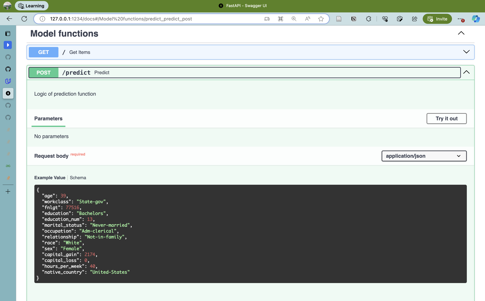
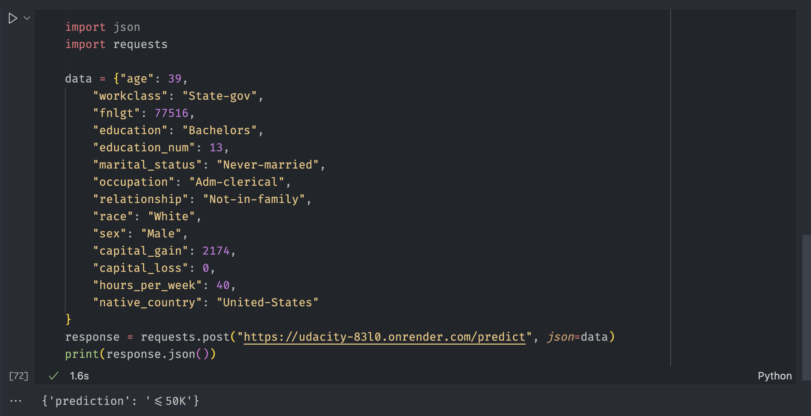

# Deploying a ML Model to Cloud Application Platform with FastAPI

## Outputs
*Model card*
[model_card.md](./model_card.md)

*Slide outputs*
[slice_output.txt](./model/slice_output.txt)

## Screenshots
*Swagger FastAPI*

*Live post*
